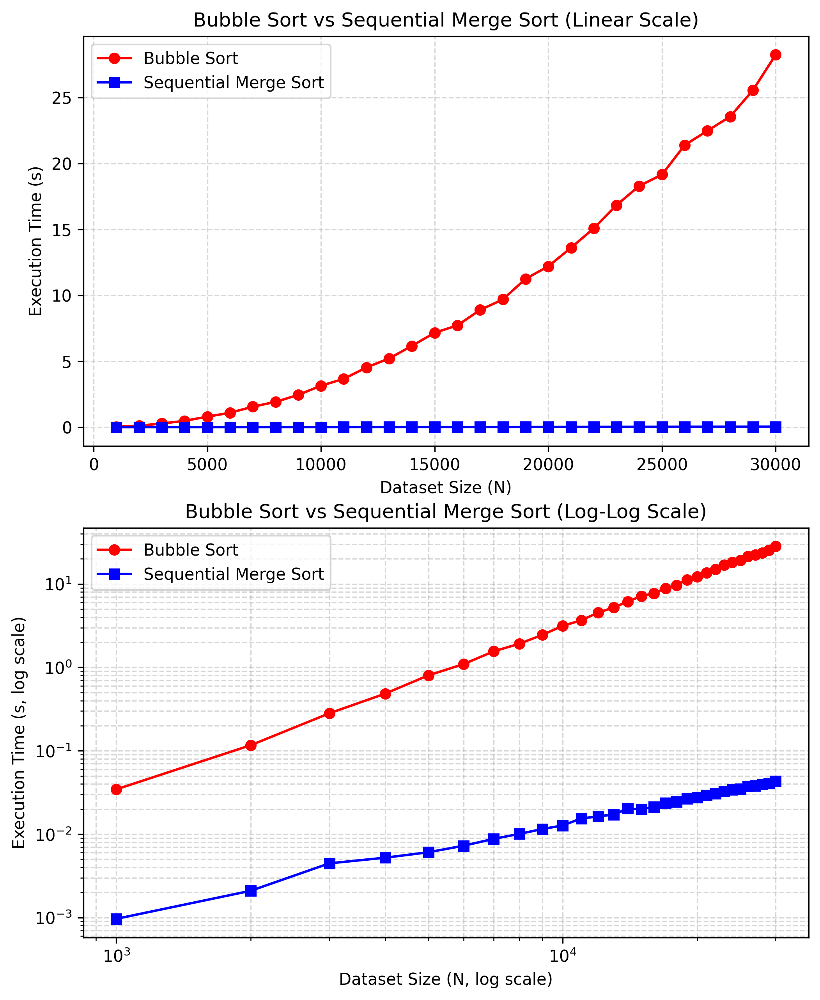
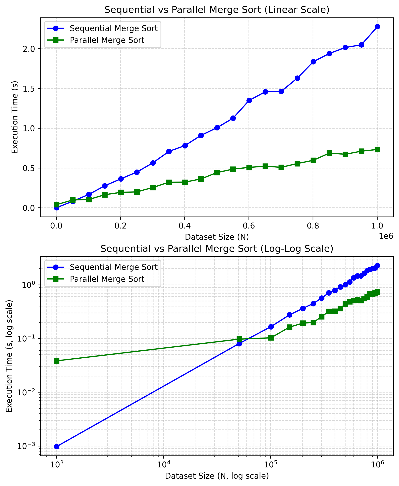

# Computer Architecture and Organization DA2

## Task 1: Sequential Execution & Performance Analysis

Sorting large datasets efficiently is a classic real-world problem. This solution:

* Implements Merge Sort, a divide-and-conquer sorting algorithm.
* Measures execution time for different dataset sizes.
* Provides linear and log-log plots of execution time versus dataset size.

### Problem Statement

* Sort a large dataset (≥ 20,000 elements) of integers efficiently.
* Analyze the performance of the algorithm in terms of execution time.
* Justify why the chosen algorithm is suitable for large-scale data.

### Algorithm Selection

**Chosen Algorithm:** Merge Sort

**Time Complexity:** O(n log n)

**Reasons for Selection:**

* Efficient for large datasets.
* Stable and predictable performance.
* Divide-and-conquer approach leverages recursive sorting of subarrays.

**Alternative Considered:** Bubble Sort (O(n²))

Impractical for large datasets; would take hours for tens of thousands of elements.

### Dataset
* List `Ns` has various sizes for lists to be used as test cases.
* Integers are randomly generated.

### Plots
Execution Time vs Dataset Size

* Linear Scale: Shows actual differences for small datasets.
* Log-Log Scale: Highlights growth trends and scalability.

## Task 2: Parallel Execution & Comparative Study

### 1. Merge Sort
* A divide-and-conquer sorting algorithm.
* Recursively splits the array into halves, sorts each half, and merges them.
* Time Complexity: O(n log n) – efficient for large datasets.
* Stable Sort: Preserves relative ordering of equal elements.

### 2. Parallel Merge Sort
* Splits the dataset across multiple CPU cores.
* Sorts subarrays in parallel, then merges results sequentially.
* Reduces overall execution time for very large datasets.
* Performance depends on dataset size and number of available CPU cores.

### Implementation
* Sequential Merge Sort: Single-threaded recursive sort.
* Parallel Merge Sort: Uses Python’s `multiprocessing.Pool` to distribute work.
* Real-Time Visualization: Execution times are plotted dynamically during computation.

### Dataset
* List `Ns` has various sizes for lists to be used as test cases.
* Integers are randomly generated.

### Plot
Execution Time vs Dataset Size

* Linear Scale: Shows actual differences for small datasets.
* Log-Log Scale: Highlights growth trends and scalability.

